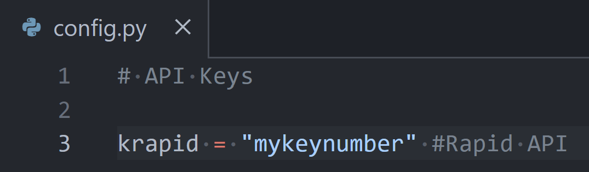
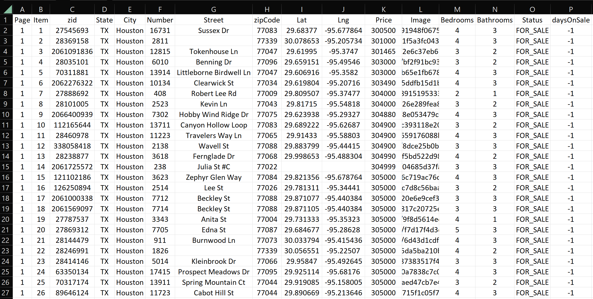

# Final Project: House Price Prediction

## Corpus Christi Team

### Step 1 (Data Collection)

The data is obtained from _Zillow.com_

The data is requested through API calls using _RapidAPI_

MAKE SURE TO INPUT YOUR RapiAPI key

Remember to store your API KEY in a _config.py_ file in the same folder

For example:
.

_Example of a config.py file_.

### Instructions to run the script

1. Make sure to use the min and max price assigned to you:
   - From 100,000 to 250,000 (Hector)
   - From 250,001 to 300,000 (Nino)
   - From 300,001 to 375,000 (Oscar)
   - From 375,001 to 500,000 (Neeraja)
   - From 500,001 to 900,000 (Dianabasi)
2. Run the script 20 times, each time increase the page number by 1 from 1 to 20.
3. In total you should pull data from about 800 houses
4. In total, the team should gather data from 4000 houses in the Houston area.

#### Outputs

**Note that each file is saved per page.**

1. A plain _.txt_ file with the raw json response (this is a backup file, so we do not need to make anothe API call in case that the connection breaks for some reason)
2. The house prediction data in _.csv_ format.

.

_Output csv file (page1)_.

**At the end we will merge all the datasets and save the merge file in a database**
